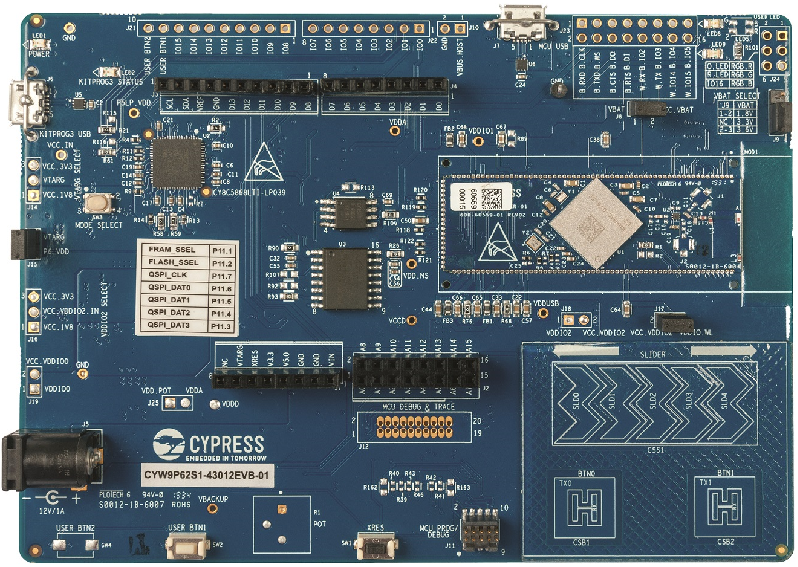

# CYW9P62S1-43012EVB-01 BSP

## Overview

The CYW9P62S1-43012EVB-01 Kit is a low-cost hardware platform that enables design and debug of the USI  WM-BAC-CYW-50 Module. USI  WM-BAC-CYW-50 is a System in Package (SiP) module that contains the PSoC 62 MCU (CY8C6247FDI-D52) and the radio part CYW43012 ( WiFi + Bluetooth Combo Chip).

To use code from the BSP, simply include a reference to `cybsp.h`.

## Features

### Kit Features:

* Support of up to 1MB Flash and 288KB SRAM
* BLE v5.0
* IEEE 802.11n, 802.11ac friendly WLAN
* Full-speed USB
* Serial memory interface
* Industry-leading CapSense

### Kit Contents:

* PSoC 6S2 Wi-Fi BT Pioneer Board
* USB Type-A to Micro-B cable
* Quick Start Guide
* Four jumper wires (4 inches each)
* Two jumper wires (5 inches each)

## BSP Configuration

The BSP has a few hooks that allow its behavior to be configured. Some of these items are enabled by default while others must be explicitly enabled. Items enabled by default are specified in the CYW9P62S1-43012EVB-01.mk file. The items that are enabled can be changed by creating a custom BSP or by editing the application makefile.

Components:
    * Device specific HAL reference (e.g.: PSOC6HAL) - This component, enabled by default, pulls in the version of the HAL that is applicable for this board.
    * CYBSP_WIFI_CAPABLE - This component, disabled by default, causes the BSP to initialize the interface to an onboard wireless chip.
    * BSP_DESIGN_MODUS - This component, enabled by default, causes the Configurator generated code for this specific BSP to be included. This should not be used at the same time as the CUSTOM_DESIGN_MODUS component.
    * CUSTOM_DESIGN_MODUS - This component, disabled by default, causes the Configurator generated code from the application to be included. This assumes that the application provides configurator generated code. This should not be used at the same time as the BSP_DESIGN_MODUS component.

Defines:
    * CY_USING_HAL - This define, enabled by default, specifies that the HAL is intended to be used by the application. This will cause the BSP to include the applicable header file and to initialize the system level drivers.

### Clock Configuration

| Clock    | Source    | Output Frequency |
|----------|-----------|------------------|
| CLK_HF0  | CLK_PATH0 | 100 MHz          |
| CLK_HF1  | CLK_PATH0 | 100 MHz          |
| CLK_HF2  | CLK_PATH0 | 50 MHz           |
| CLK_HF3  | CLK_PATH1 | 48 MHz           |

### Power Configuration

* System Active Power Mode: LP
* System Idle Power Mode: Deep Sleep
* VDDA Voltage: 1800 mV
* VDDD Voltage: 1800 mV

## API Reference Manual

The CYW9P62S1-43012EVB-01 Board Support Package provides a set of APIs to configure, initialize and use the board resources.

See the [BSP API Reference Manual][api] for the complete list of the provided interfaces.

## More information
* [CYW9P62S1-43012EVB-01 BSP API Reference Manual][api]
* [CYW9P62S1-43012EVB-01 Documentation](https://www.cypress.com/documentation/development-kitsboards/cyw9p62s1-43012evb-01-psoc-62s1-wi-fi-bt-pioneer-kit)
* [Cypress Semiconductor](http://www.cypress.com)
* [Cypress Semiconductor GitHub](https://github.com/cypresssemiconductorco)
* [ModusToolbox](https://www.cypress.com/products/modustoolbox-software-environment)

[api]: https://cypresssemiconductorco.github.io/TARGET_CYW9P62S1-43012EVB-01/html/modules.html

---
© Cypress Semiconductor Corporation, 2019-2020.